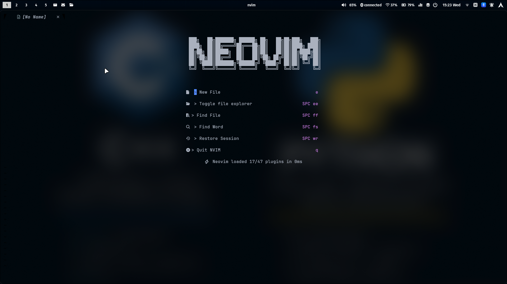

#  Custom Neovim Configuration

A highly optimized, feature-rich Neovim configuration built for speed, productivity, and aesthetics.



_(Actual Interface: File Tree, Status Line, and LSP support)_

## ✨ Why this config?

- **IDE Experience:** Includes File Explorer (NvimTree), Fuzzy Finder, and Tabs.
- **Smart Coding:** Full LSP support (Go-to-definition, Autocomplete, Rename) just like a pro IDE.
- **Git Power:** Manage source control directly with LazyGit and Gitsigns.
- **Beautiful UI:** Polished interface with OneDarkPro theme, icons, and status lines.
- **Blazing Fast:** Starts up instantly using `lazy.nvim`.

---

## ⚡ Core Info

- **Leader Key:** `<Space>`
- **Plugin Manager:** [lazy.nvim](https://github.com/folke/lazy.nvim)
- **Colorscheme:** OneDarkPro

---

## Keybindings Cheat Sheet

### 1. 🪟 Window Management

| Key Mapping  | Action                        |
| :----------- | :---------------------------- |
| `<leader>sv` | Split window **v**ertically   |
| `<leader>sh` | Split window **h**orizontally |
| `<leader>se` | Make splits **e**qual size    |
| `<leader>sx` | Close current split           |
| `<leader>sm` | **M**aximize / Restore split  |

### 2. 📂 File Explorer (NvimTree)

| Key Mapping  | Action                    |
| :----------- | :------------------------ |
| `<leader>ee` | Toggle **E**xplorer       |
| `<leader>ef` | Find file in **E**xplorer |
| `<leader>ec` | **C**ollapse all folders  |
| `<leader>er` | **R**efresh explorer      |

### 3. 🔍 Fuzzy Finder (Telescope)

| Key Mapping  | Action                       |
| :----------- | :--------------------------- |
| `<leader>ff` | Find **f**iles               |
| `<leader>fr` | Find **r**ecent files        |
| `<leader>fs` | Find **s**tring (Grep)       |
| `<leader>fc` | Find string under **c**ursor |
| `<leader>fb` | Find **b**uffers             |
| `<leader>ft` | Find **T**odo comments       |
| `Ctrl + q`   | Send to Quickfix list        |

### 4. 🧠 Code Intelligence (LSP)

| Key Mapping  | Action                       |
| :----------- | :--------------------------- |
| `gd`         | Go to **d**efinition         |
| `gD`         | Go to **D**eclaration        |
| `gr`         | Go to **r**eferences         |
| `K`          | Hover Documentation          |
| `<leader>rn` | **R**e**n**ame symbol        |
| `<leader>mp` | **M**ake **P**retty (Format) |
| `<leader>l`  | Trigger Linting              |
| `<leader>rs` | Restart LSP                  |

### 5.  Git Integration

| Key Mapping  | Action               |
| :----------- | :------------------- |
| `<leader>lg` | Open **L**azy**G**it |
| `]h`         | Next **H**unk        |
| `[h`         | Previous **H**unk    |
| `<leader>hs` | **S**tage hunk       |
| `<leader>hr` | **R**eset hunk       |
| `<leader>hb` | **B**lame line       |
| `<leader>tb` | **T**oggle **b**lame |

### 6.  Diagnostics & Errors (Trouble)

| Key Mapping  | Action                    |
| :----------- | :------------------------ |
| `<leader>xw` | **W**orkspace diagnostics |
| `<leader>xd` | **D**ocument diagnostics  |
| `<leader>xq` | Toggle **Q**uickfix list  |
| `<leader>xt` | Toggle **T**odo list      |
| `]t` / `[t`  | Next / Prev Todo          |

### 7. 🛠️ Editing Utilities

#### Comments

| Key Mapping | Action               |
| :---------- | :------------------- |
| `gcc`       | Toggle line comment  |
| `gbc`       | Toggle block comment |

#### Surround (nvim-surround)

> Example: `ysw"` surrounds a word with `""`

| Key Mapping        | Action              |
| :----------------- | :------------------ |
| `ys{motion}{char}` | **Add** surround    |
| `ds{char}`         | **D**elete surround |
| `cs{old}{new}`     | **C**hange surround |

#### Substitute

| Key Mapping | Action                      |
| :---------- | :-------------------------- |
| `s{motion}` | Substitute with register    |
| `ss`        | Substitute line             |
| `S`         | Substitute visual selection |

### 8.  Docker (LazyDocker)

| Key Mapping  | Action                  |
| :----------- | :---------------------- |
| `<leader>ld` | Open **L**azy**D**ocker |

### 9. 🛢️ Database Management (Dadbod)

**General & UI Drawer**

| Key Mapping  | Action                     |
| :----------- | :------------------------- |
| `<leader>db` | Toggle **D**ata**b**ase UI |
| `A`          | **A**dd new connection     |
| `S`          | Open new **S**QL query     |
| `d`          | **D**elete connection      |
| `r`          | **R**ename connection      |

**SQL Buffer (Inside .sql files)**

| Key Mapping    | Action                          |
| :------------- | :------------------------------ |
| `<leader>S`    | Execute **S**QL Query           |
| `<leader>W`    | **S**ave Query                  |
| `Ctrl + Space` | Trigger Table/Column Completion |

---

## 📦 Installation

1. **Backup** your current configuration:
   ```bash
   mv ~/.config/nvim ~/.config/nvim.bak
   mv ~/.local/share/nvim ~/.local/share/nvim.bak
   ```
2. **Install Configuration** Clone this repository directly into your ~/.config/nvim directory. This is the path where Neovim looks for configuration files by default.
   ```bash
   git clone https://github.com/tuongwall/neovim-setup.git ~/.config/nvim
   ```
3. **Start Neovim**
   ```bash
   nvim
   ```

**note:** you might see some errors during the first installation. simply restart neovim (`:q` then open nvim again) and run `:checkhealth` to verify everything is set up correctly.
